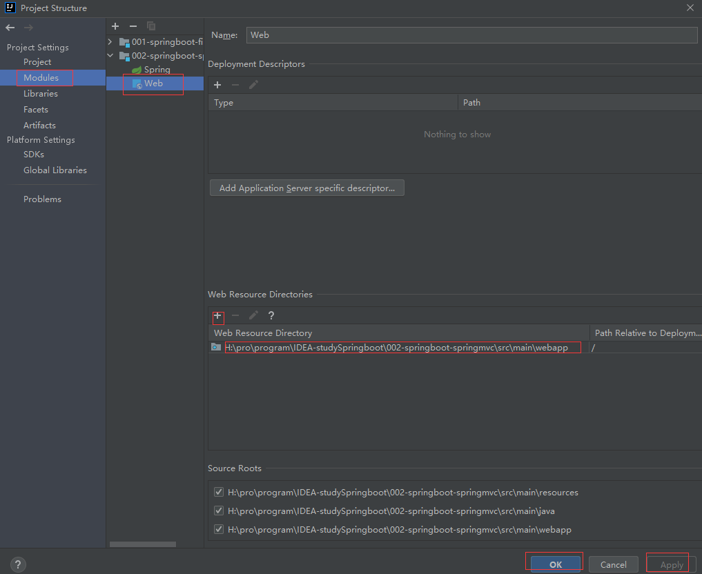

# SpringBoot+JSP页面

* [Official Apache Maven documentation](https://maven.apache.org/guides/index.html)
####注意:
@RestController//相当于@Controller（视图解析器可以解析return 的jsp,html页面） + @ResponseBody （返回json等内容到页面）

### 1、在pom.xml加载视图解析器依赖
        <dependency>
            <groupId>org.apache.tomcat.embed</groupId>
            <artifactId>tomcat-embed-jasper</artifactId>
        </dependency>
#### 接着添加<resource></resource>标签，配置资源路径:
    <build>
        <plugins>
            <plugin>
                <groupId>org.springframework.boot</groupId>
                <artifactId>spring-boot-maven-plugin</artifactId>
            </plugin>
        </plugins>
        <resources>
            <resource>
                <directory>src/main/webapp</directory>
                <targetPath>META-INF/resources</targetPath>
                <includes>
                    <include>*.*</include>
                </includes>
            </resource>
        </resources>
    </build>
###2、在application.properties文件添加：
spring.mvc.view.prefix=/

spring.mvc.view.suffix=.jsp

###3、在main文件夹目录下新增webapp文件夹，并在其添加jsp文件，设置webapp文件为web资源包
